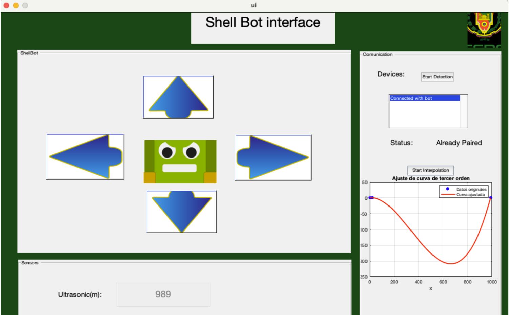

# Shell Bot

As an software and hardaware application in numerical methods, Shell bot aims to provide a simple easy-to-use robot control built in matlab using sensors and interpolation methods.


## Features
- [x] Sensors: Use an ultrasonic sensor to detect the distance between the robot and obstacles
- [x] Interpolation methods: Use Splines in 3rd degree to interpolate the points
- [x] UI: Use a simple UI to control the robot
- [x] Robot: Use a simple robot to move in a 2D plane

## Installation
1. Clone the repository

```bash
git clone https://github.com/Cotbert2/ShellBot.git
```

2. Open the project in Matlab or Octave

3. Run the main file

Once you run the main file a User interface will appear, you can use the buttons to control the robot.
Remember change the MAC Adress of the bluetooth module in the code to your own MAC Adress.

## UI



## Contributing

Project is open for contributions, feel free to fork and make a pull request with your changes.

## License
[MIT](https://choosealicense.com/licenses/mit/)